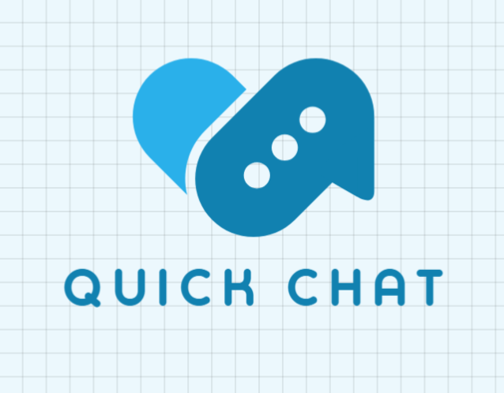

# Quick-Chat

A real-time chat application where messages appear instantly for everyone connected. Built with React and Socket.io.



## Features

- **Real-time messaging**: Messages are delivered instantly over WebSockets, no page reloads.
- **User identification**: Each user gets a unique ID stored in session storage, with avatars to tell people apart.
- **Responsive design**: Works on mobile, tablet, and desktop.
- **Clean UI**: Built with Chakra UI components.

## Tech stack

**Frontend:** React (Vite), Chakra UI, socket.io-client

**Backend:** Express.js, Socket.io

## Project structure

```
├── client/                 # Frontend (React + Chakra UI)
│   └── src/
│       ├── components/     # UI components (ChatBox)
│       ├── App.jsx
│       └── assets/
├── server/                 # Backend (Express + Socket.io)
│   └── server.js
└── readme.md
```

## Setup and installation

### Prerequisites

- Node.js 14+
- npm or yarn

### Steps

1. Clone the repository:

```bash
git clone https://github.com/K-Ananthamoorthy/Quick-Chat.git
cd Quick-Chat
```

2. Install server dependencies:

```bash
cd server
npm install
```

3. Install client dependencies:

```bash
cd ../client
npm install
```

4. Start the backend:

```bash
cd ../server
node server.js
```

The server runs on `http://localhost:4000`.

5. Start the frontend in another terminal:

```bash
cd client
npm run dev
```

Open `http://localhost:5173` in your browser.

## How it works

The client and server communicate over WebSockets using Socket.io. When a user sends a message, the server broadcasts it to every connected client, so everyone sees it immediately.

## Future enhancements

- User authentication (login/signup)
- Multiple chat rooms
- Message history stored in a database
- Typing indicators
- File and image sharing

## License

MIT. See [LICENSE](LICENSE).
